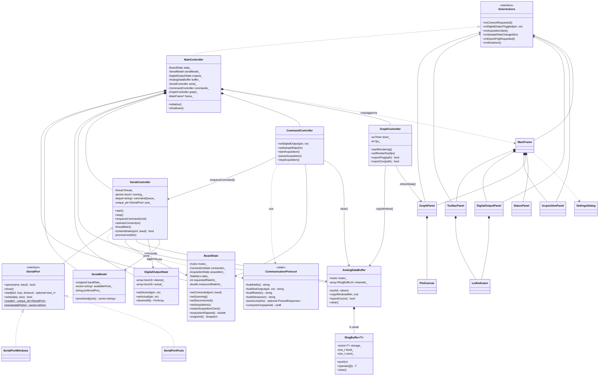

# Diagramma UML delle classi (Mermaid)

Renderizzabile su GitHub/GitLab o con qualunque viewer Mermaid.
La versione PlantUML equivalente è in `ClassDiagram.puml`.

```mermaid
classDiagram
    direction TB

    %% ===================== MODEL =====================
    class BoardState {
        -mutex mutex_
        -ConnectionState connection_
        -AcquisitionState acquisition_
        -Statistics stats_
        -int requestedRateHz_
        -double measuredRateHz_
        +setConnected(port, baud)
        +setScanning()
        +setDisconnected()
        +setAcquisition(s)
        +restartAcquisitionClock()
        +acquisitionElapsed() double
        +snapshot() Snapshot
    }

    class SerialModel {
        -unsigned baudRate_
        -vector~string~ availablePorts_
        -string preferredPort_
        +prioritized(ports) vector~string~
    }

    class AnalogDataBuffer {
        -mutex mutex_
        -array~RingBuffer,6~ channels_
        +push(t, values)
        +copyWindow(tMin, out)
        +exportCsv(os) bool
        +clear()
    }

    class RingBuffer~T~ {
        -vector~T~ storage_
        -size_t head_
        -size_t count_
        +push(v)
        +operator[](i) T
        +clear()
    }

    class DigitalOutputState {
        -array~bool,8~ desired_
        -array~bool,8~ actual_
        +setDesired(pin, on)
        +setActual(pin, on)
        +desiredAll() PinArray
    }

    class CommunicationProtocol {
        <<static>>
        +buildHello() string
        +buildSetOutput(pin, on) string
        +buildRate(hz) string
        +buildStream(on) string
        +parseLine(line) optional~ParsedResponse~
        +computeXor(payload) uint8
    }

    %% ===================== SERIAL =====================
    class ISerialPort {
        <<interface>>
        +open(name, baud) bool
        +close()
        +read(buf, max, timeout) optional~size_t~
        +write(data, size) bool
        +create() unique_ptr~ISerialPort~$
        +enumeratePorts() vector~string~$
    }
    class SerialPortWindows
    class SerialPortPosix
    ISerialPort <|.. SerialPortWindows
    ISerialPort <|.. SerialPortPosix

    %% ===================== CONTROLLER =====================
    class IUserActions {
        <<interface>>
        +onConnectRequested()
        +onDigitalOutputToggled(pin, on)
        +onAcquisitionStart()
        +onSampleRateChanged(hz)
        +onExportPngRequested()
        +onShutdown()
    }

    class MainController {
        -BoardState state_
        -SerialModel serialModel_
        -DigitalOutputState outputs_
        -AnalogDataBuffer buffer_
        -SerialController serial_
        -CommandController commands_
        -GraphController graph_
        -MainFrame* frame_
        +initialize()
        +shutdown()
    }

    class SerialController {
        -thread thread_
        -atomic~bool~ running_
        -deque~string~ commandQueue_
        -unique_ptr~ISerialPort~ port_
        +start()
        +stop()
        +enqueueCommand(cmd)
        +setAutoConnect(on)
        -threadMain()
        -tryHandshake(port, baud) bool
        -processLine(line)
    }

    class CommandController {
        +setDigitalOutput(pin, on)
        +setSampleRate(hz)
        +startAcquisition()
        +pauseAcquisition()
        +stopAcquisition()
    }

    class GraphController {
        -wxTimer timer_
        -int fps_
        +startRendering()
        +setRenderFps(fps)
        +exportPng(path) bool
        +exportCsv(path) bool
    }

    %% ===================== VIEW =====================
    class MainFrame
    class ToolbarPanel
    class DigitalOutputPanel
    class AcquisitionPanel
    class GraphPanel
    class PlotCanvas
    class StatusPanel
    class SettingsDialog
    class LedIndicator

    %% ===================== RELAZIONI =====================
    IUserActions <|.. MainController
    MainController *-- BoardState
    MainController *-- SerialModel
    MainController *-- DigitalOutputState
    MainController *-- AnalogDataBuffer
    MainController *-- SerialController
    MainController *-- CommandController
    MainController *-- GraphController
    MainController ..> MainFrame : crea/aggiorna

    SerialController o-- ISerialPort
    SerialController ..> CommunicationProtocol : usa
    SerialController --> BoardState : aggiorna
    SerialController --> AnalogDataBuffer : push()
    SerialController --> DigitalOutputState : setActual()
    SerialController --> SerialModel : porte

    CommandController --> SerialController : enqueueCommand()
    CommandController ..> CommunicationProtocol : usa
    CommandController --> BoardState
    CommandController --> AnalogDataBuffer : clear()

    GraphController --> AnalogDataBuffer : copyWindow()
    GraphController --> GraphPanel : refreshData()

    AnalogDataBuffer *-- RingBuffer~T~ : 6 canali

    MainFrame *-- ToolbarPanel
    MainFrame *-- DigitalOutputPanel
    MainFrame *-- AcquisitionPanel
    MainFrame *-- GraphPanel
    MainFrame *-- StatusPanel
    GraphPanel *-- PlotCanvas
    ToolbarPanel *-- LedIndicator
    DigitalOutputPanel *-- LedIndicator

    ToolbarPanel --> IUserActions
    DigitalOutputPanel --> IUserActions
    AcquisitionPanel --> IUserActions
    GraphPanel --> IUserActions
    MainFrame --> IUserActions
    MainFrame ..> SettingsDialog
```
